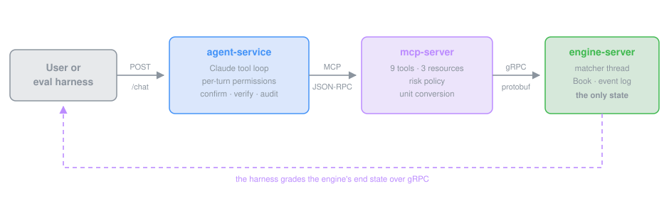

# auto_trading_agent

A local ETH/USDC trading system in Rust. Ask Claude or DeepSeek to check prices, place limit orders or cancel them, then inspect the tool calls, fills and balances in the browser.

The demo runs its own order book with simulated balances. **The model requests actions; code checks funds, order parameters and risk limits.** Intent recognition uses heuristics, and the services are intended for local use without caller authentication.

1. **Matching engine:** processes orders, settles balances and journals state, exposed over gRPC.
2. **MCP server:** gives the model eleven market and account tools with risk checks.
3. **Chat service:** manages conversations, order confirmations and audit records.
4. **Evaluation harness:** checks actual orders and trades across execution, safety and paraphrase cases.



## Quick start

You need Rust 1.88 or newer and `make`. Nothing else: the protobuf compiler is vendored, and the page has no build step.

**1. Add a model key** (optional, but it is what turns chat on):

```sh
cp .env.example .env      # then paste ANTHROPIC_API_KEY or DEEPSEEK_API_KEY, or both
```

`make` reads `.env` on every run. With both keys the page offers a model dropdown; `MODEL_PROVIDER=deepseek` in `.env` makes DeepSeek the default.

**2. Start the demo:**

```sh
make demo-web
```

The first build takes a few minutes. When it prints `web demo   http://127.0.0.1:8080`, open that address.

Without a Rust toolchain, the same page runs from a container (Docker 20 or newer):

```sh
make demo-docker          # or: docker build -t auto-trading-agent . && docker run --rm -p 8080:8080 --env-file .env auto-trading-agent
```

The image builds the workspace inside `rust:1.88` and ships only the binary, the scenario files and the recorded reports. Open http://localhost:8080 once it prints the same line. Create `.env` first (an empty file is fine) or drop the `--env-file` flag.

**3. What you see:** one page running the whole stack. A chat with the agent, and beside it the live order book, the last trades, the session and the audit log. Type "Buy 0.5 ETH at 3000" and watch the order appear in the book; type "Sell 0.3 ETH now" and the service holds it for your confirmation. The tabs underneath open the engine, the MCP server, the evaluation harness and the recorded results.

Without a key, everything works except the chat itself: the MCP tools, the load test, the hostile-model runs against the gate, the evaluation suites and the reports.

**Other ways to run it:**

```sh
make demo                         # the same eight-turn conversation in the terminal; needs a key
make eval-oracle                  # the evaluation harness with a scripted agent; no key needed
cargo test --workspace --locked   # 119 unit, property and integration tests
```

The three services can also run separately (`make run-engine`, `make run-mcp`, `make run-agent`); the [runbook](docs/09-runbook.md) covers configuration, ports and troubleshooting.

## Where to look

* [Walkthrough](docs/10-walkthrough.md): commands and expected output for each part of the stack.
* [Results](docs/results/README.md): measurements and the reports behind them.
* [Task coverage](docs/00-coverage.md): requirements mapped to code and tests.

## Results

Recorded measurements on Apple M1 Pro, release builds, loopback. DeepSeek V4 Flash: 57/57 on the final gate, 57/57 with every turn perturbed, 0 unauthorised mutations. See [results](docs/results/README.md) for every report and how to reproduce it.

| Measurement | Result |
|---|---|
| Throughput | 730k to 840k book operations/s; 955k orders/s on one pipelined gRPC stream, 61k to 69k with 16 unary clients |
| Restart soak, 4 × 1M journaled orders | memory flat at about 110 MB; recovery 2.2 to 2.5 s |
| Accuracy | DeepSeek V4 Flash 57/57; Claude Sonnet 5 170/171 over three reps |
| Safety | 39/39 attacks blocked; five hostile model strategies cause 0 unauthorised mutations |
| Prompt robustness | 57/57 with every turn perturbed, on both models |
| Reply quality, judged | clarity 4.81/5, faithful 55/57; the judge found two replies the end state could not fault |
| Cost | 0.05 USD per DeepSeek run of the suite; 92 to 95% of prompt tokens from cache |

## Layout

```
proto/clob.proto        gRPC API contract
crates/engine           matching, wallets, journaling and replay
crates/engine-server    gRPC service and concurrency tests
crates/mcp-server       tools, risk policy and protocol transports
crates/agent-service    model clients, chat loop, confirmations and audit
crates/evals            evaluation harness, simulation and browser demo
evals/cases/            57 scenarios: execution, paraphrase, safety
scripts/                MCP interoperability checks, soak, docmap
docs/                   design, setup guides and recorded results
```

## Design

* **Integer accounting.** Ticks of 0.01 USDC, lots of 0.0001 ETH, notionals in `u128`; decimals convert exactly at the MCP boundary.
* **Single writer, batched.** One thread owns the book; a snapshot is published before replies go out, so a client always sees its own order.
* **Deterministic replay.** Counter-based ordering, a command journal and bounded closed history.
* **Stable prompts.** A fixed system prompt and tool list support caching; per-turn permissions are enforced when a tool is called.
* **Guardrails as code.** Risk policy in the MCP server; in the service, permission from the user's own words, confirmation, a verifier, reply grounding and a fail-closed audit chain.
* **Few dependencies.** tokio, hyper, tonic, prost, serde, reqwest, arc-swap, tracing, sha2. No MCP SDK, web framework, decimal or RNG crate.

## Documentation

[Documentation index](docs/README.md) · [Architecture](docs/01-architecture.md) · [Guardrails](docs/05-guardrails.md) · [Evaluation](docs/06-evaluation.md) · [Design decisions](docs/07-decisions.md)

## Next

Metrics dashboards and alerts on the counters now exposed; a second live model comparison at three reps once a key allows it; time-in-force post-only orders. Sharding by symbol is out of scope for a single-pair slice by design (ADR-22).
