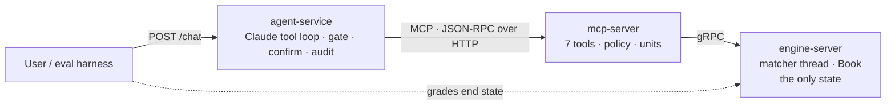

# auto_trading_agent

A vertical slice of infrastructure for autonomous AI agents trading on a market, in Rust:

1. **A deterministic matching engine** for ETH/USDC behind gRPC (tonic). One matcher thread owns the book; handlers send commands over a bounded channel, so the engine is thread-safe without a lock on the book and every event has a total order.
2. **An MCP server** so a model can perceive the book and act on it. The Model Context Protocol layer is written by hand as JSON-RPC 2.0 on `serde_json`, over stdio (Claude Desktop, Claude Code) and Streamable HTTP, and verified against the official MCP client.
3. **A natural-language service** that runs Claude in a tool loop over those MCP tools through the Messages API, with layered guardrails: schema and unit validation, a deterministic risk policy, tool gating on explicit intent, confirmation of large orders, idempotency keys, a post-turn verifier and an audit log.
4. **An evaluation harness** that seeds a fresh engine per case, drives the real service, and grades the engine's end state, with oracle and null agents bounding the harness from above and below, plus a market simulation.



The rule that keeps the design honest: **the model may only ever request an action.** Validation, risk limits, identity and ordering are enforced in code below it, so no prompt can bend them.

## Quick start

```
cargo build --workspace --release
cargo test --workspace                                   # 37 tests: unit, property, concurrency, protocol, HTTP, agent loop
cargo run -p evals -- run --agent oracle                 # validates the harness without a model
cargo run --release -p engine-server                     # gRPC on 0.0.0.0:50051
cargo run --release -p mcp-server -- --http              # MCP on 127.0.0.1:8000/mcp   (no flag = stdio)
ANTHROPIC_API_KEY=... cargo run --release -p agent-service     # POST /chat on 127.0.0.1:8080
curl -s localhost:8080/chat -H 'content-type: application/json' -d '{"session_id":"me","message":"buy 0.5 ETH at 3000"}'
```

No system `protoc` is required: `build.rs` uses the vendored one. See the [runbook](docs/09-runbook.md) for environment variables, connecting a desktop MCP host, and troubleshooting.

## Results

Measured in the environment this code was written in (a shared cloud container, release builds, loopback networking); rerun with `make bench`, `make eval-oracle`, `make eval-null`, `make sim`.

| Measurement | Result |
|---|---|
| Engine, pure book (1M places + 250k cancels, random prices, 780k trades) | 162k operations/s, 6.2 µs per operation, allocation-heavy idempotency bookkeeping included |
| gRPC `PlaceOrder`, sequential, in-process server | p50 275 µs, p99 448 µs |
| gRPC `PlaceOrder`, 16 concurrent clients | 35k orders/s |
| Concurrency test: 16 clients × 500 orders | every response OK, sequence numbers unique and contiguous, book never crossed |
| MCP interoperability (official Python client, stdio and HTTP) | all tools, resources and the prompt, output schemas validated: `INTEROP OK` |
| Evaluation harness, oracle agent, 37 cases × 3 reps | execution 100% (45/45), paraphrase 100% (36/36), safety 100% (30/30, 24/24 attacks blocked) |
| Evaluation harness, null agent | execution 0%, paraphrase 0%, safety 70% (7/8 attacks blocked, both benign requests failed as they must) |

Full reports: [oracle](docs/results/report-oracle.md), [null](docs/results/report-null.md), [simulation baseline](docs/results/sim-baseline.md). Model-driven runs (`--agent model`) need `ANTHROPIC_API_KEY` and were not possible in the authoring environment; the harness, the agent loop and the API request shape are covered by the mock-model tests in `crates/agent-service/tests/agent.rs`.

## Layout

```
proto/clob.proto              the gRPC contract (integer ticks and lots, sequence numbers)
crates/clob-proto             generated code
crates/engine                 book.rs (pure matching, property-tested), sequencer.rs (single writer)
crates/engine-server          tonic servicer, status mapping, concurrency test, gRPC benchmark
crates/mcp-server             jsonrpc.rs, protocol.rs, tools.rs, policy.rs, units.rs, transport/{stdio,http}.rs
crates/agent-service          anthropic.rs, mcp_client.rs, gate.rs, agent.rs, audit.rs, http.rs, prompts/system.md
crates/evals                  cases.rs, agents.rs, harness.rs, report.rs, sim.rs
evals/cases/                  37 scenarios: execution, paraphrase, safety
scripts/mcp_interop_check.py  drives the MCP server with the official Python client
docs/                         architecture, engine, MCP, agent service, guardrails, evaluation, decisions, dependencies, runbook
```

## Design in one screen

* **Integers, never floats.** Price in ticks of 0.01 USDC, quantity in lots of 0.0001 ETH, notionals in `u128`. Decimal strings are converted exactly at the MCP boundary.
* **Single writer.** The book is moved into one thread; the compiler guarantees nothing else touches it. Reads take a lock-free snapshot. The bounded queue gives backpressure (`RESOURCE_EXHAUSTED`).
* **Deterministic.** Counters for ids and sequence numbers, clocks for reporting only; the property test replays every generated command list and asserts an identical event log.
* **Idempotent.** `client_order_id` makes retries safe end to end: the engine replays the original reply, the service derives the key from session, turn and tool-call id.
* **MCP designed for the model.** Human units in and out, descriptions that say when to call, precomputed quotes and averages, small payloads, typed structured output, errors that read as instructions, and three deliberate error channels (protocol error, `isError` result, structured policy rejection).
* **Guardrails as code.** Policy in the MCP server (size, value, collar, open orders, rate, session cap, kill switch); gating, confirmation, verifier and audit in the service. See [05 Guardrails](docs/05-guardrails.md).
* **Battle-tested dependencies only.** tokio, hyper, tonic, prost, serde, reqwest, arc-swap, tracing; the MCP SDK, web frameworks and decimal, schema, benchmark and RNG crates were left out on purpose. See [08 Dependencies](docs/08-dependencies.md).

## What I would do next

Persist the event log so the engine can recover by replay; stream book deltas to the MCP layer instead of polling; shard by symbol for more pairs; run the model-driven evaluation suites and the simulation with several effort levels and publish the numbers; add balances and a settlement layer so the simulation can score realised P&L.
