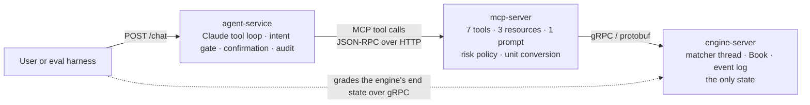

# 01 · Architecture

## The shape of the system

Four components in a line. Only the engine holds state and enforces market rules; every layer above it translates.



* **engine** (library) is the pure order book: no I/O, no threads, no clocks.
* **engine-server** wraps it in tonic. Every handler task sends a command to the one matcher thread and awaits the reply.
* **mcp-server** speaks the Model Context Protocol, written by hand as JSON-RPC 2.0 on `serde_json`, over stdio (for Claude Desktop and Claude Code) and Streamable HTTP (for the service and the MCP Inspector). It holds one gRPC client and the deterministic risk policy.
* **agent-service** turns a sentence into tool calls with Claude through the Messages API over raw HTTPS, and owns the conversation-level guardrails.
* **evals** drives the whole stack in-process, seeds the book, runs a case, and grades what the engine ended up holding.

## The rule that keeps the design honest

The model may only ever *request* an action. Validation, risk limits, identity and ordering are enforced in code below it: the MCP server validates and applies policy, the engine validates again and sequences, and the service decides which tools a turn may use. No prompt can bend any of that.

## Data flow of one order

1. The user writes "buy half an ETH at 3000".
2. The service sees a trade verb, offers `place_limit_order` among the tools for this turn, and calls Claude.
3. Claude calls `place_limit_order(side="buy", price_usdc="3000", quantity_eth="0.5")`. The service adds an idempotency key and, because 0.5 ETH is below the confirmation threshold, forwards the call.
4. The MCP server parses the decimals exactly into 300000 ticks and 5000 lots, runs the risk policy (size, value, collar, open orders, rate, session cap, kill switch), and sends `PlaceOrder` over gRPC.
5. The tonic handler queues the command; the matcher thread applies it, records events, publishes a new snapshot and replies. The response carries the order and any fills.
6. The MCP server returns human units and precomputed numbers (filled quantity, average price) as structured content; the service feeds it back to Claude, which answers in one sentence.
7. The verifier confirms the executed action matches the user's words, and the turn is written to the audit log.

## Units

| Quantity | Wire type | Scale | Example |
|---|---|---|---|
| price | `int64 price_ticks` | 1 tick = 0.01 USDC | 3000.50 USDC = 300050 |
| quantity | `int64 quantity_lots` | 1 lot = 0.0001 ETH | 0.25 ETH = 2500 |
| notional | `u128` ticks × lots | 1 unit = 0.000001 USDC | 3601.90 USDC = 3601900000 |

Floats appear nowhere. The MCP layer converts decimal strings to integers and back with exact arithmetic (`crates/mcp-server/src/units.rs`).

## Repository layout

```
proto/clob.proto              the gRPC contract
crates/clob-proto             generated code (build.rs runs the vendored protoc)
crates/engine                 book.rs (pure matching), sequencer.rs (single writer), examples/bench.rs
crates/engine-server          tonic servicer, status mapping, tests/concurrency.rs, examples/grpc_bench.rs
crates/mcp-server             jsonrpc.rs, protocol.rs, tools.rs, policy.rs, units.rs, transport/{stdio,http}.rs
crates/agent-service          anthropic.rs, mcp_client.rs, gate.rs, agent.rs, audit.rs, http.rs, prompts/system.md
crates/evals                  cases.rs, agents.rs, harness.rs, report.rs, sim.rs
evals/cases/{execution,paraphrase,safety}   scenario files
scripts/mcp_interop_check.py  drives the MCP server with the official Python client
docs/                         these pages
```
