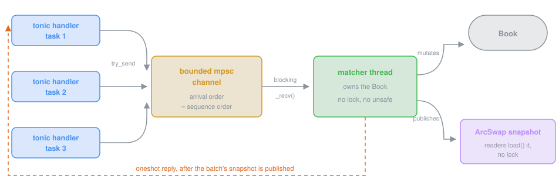

# 02 · The engine

An order book is two sorted lists: bids highest price first, asks lowest first. A new limit
order trades against the other side at any price satisfying its limit; the remainder waits at
its own price, behind orders already there. Cancel removes a waiting order. That is the whole
business logic — everything below is data structures, determinism and concurrency.

## Matching rules

| Rule | Behaviour |
|---|---|
| Price-time priority | Best price first; at the same price, first in, first out |
| Crossing | A buy at P matches asks priced at or below P; a sell at P matches bids at or above P |
| Maker price | Trades execute at the resting order's price; the taker gets the price improvement |
| GTC | The unfilled remainder rests at the order's own limit |
| IOC | The unfilled remainder is cancelled |
| FOK | Availability is checked first; the order is rejected without touching the book if the full quantity is not there |
| Self-trade prevention | "Cancel newest": an incoming order never trades with its own account's resting order; matching stops there and the remainder is cancelled |
| Idempotency | `client_order_id` is unique per account. The same request again returns the original reply (order and fills); the same key with different parameters is `ALREADY_EXISTS` |

### Worked example

Resting: asks 3001.00 × 0.5 (A1), 3002.00 × 1.0 (A2); bid 2999.00 × 0.8. Incoming: buy 1.2 @ 3002.00.

1. 0.5 trades at **3001.00** (A1's price, not 3002.00). A1 is filled and removed.
2. 0.7 trades at 3002.00. A2 has 0.3 left.
3. The incoming order is filled: 1.2 ETH for 3601.90 USDC, average 3001.58.

This scenario is the first unit test in `crates/engine/src/book.rs` and is replayed through gRPC and MCP in the other crates' tests.

## Data structures

```rust
pub struct Book {
    bids: BTreeMap<Price, Level>,                      // best bid = last key
    asks: BTreeMap<Price, Level>,                      // best ask = first key
    orders: HashMap<OrderId, Order>,                   // O(1) cancel and lookup
    by_account: HashMap<Arc<str>, Vec<OrderId>>,       // one account's orders, placement order
    by_client_id: HashMap<Arc<str>, HashMap<Arc<str>, OrderId>>, // idempotency: account -> client id
    original_replies: HashMap<OrderId, (Order, Vec<Trade>)>,
    events: Vec<Event>,                                // append-only history
    trades: Vec<Trade>,                                // sequence order
    trades_by_account: HashMap<Arc<str>, Vec<usize>>,  // positions in `trades`
    last_trade_price: Option<Price>,
    next_order: u64, next_trade: u64, next_seq: u64,   // counters, never clocks or UUIDs
}
struct Level { total: Qty, live: u32, queue: VecDeque<OrderId> }  // FIFO of ids = time priority
```

Each level holds a FIFO of order ids, so an order lives in exactly one place. Cancel is O(1): mark the order, subtract its remaining quantity from the level total, drop the level when the total reaches zero; the matcher skips cancelled ids lazily when it reaches them.

**Nothing grows without bound.** Live orders are always kept. Closed orders are kept for the last 100,000 closings (`RETAINED_CLOSED_ORDERS`) and trades for the last 100,000 (`RETAINED_TRADES`); beyond that the oldest closed order is archived (it leaves the lookups, its account's listing and the idempotency index, so `GetOrder` answers `NOT_FOUND` and a retry of its client id is a new order) and the oldest trade is dropped. Balances, ledgers and the book itself are never touched by archiving: an account's statement still counts every fill. The per-account order index is an ordered set, so an archived order leaves in logarithmic time and listings stay newest-first. A cancelled order that was archived while still in a level's queue is skipped when the matcher reaches it, like any lazily cancelled order. The event log kept for inspection is a ring of the last 100,000 events, the broadcast takes its events from a buffer the sequencer drains every batch, and an idempotent retry is answered by rebuilding the original reply from the order's record, the quantity it filled at placement and the fill ids that are still retained, rather than from a stored copy of every order. The archiving order is part of the snapshot, so a restarted engine forgets the same orders as one that never stopped. Cost: the benchmark's million orders and 780k trades peak at 406 MB instead of 761 MB, at about 8% of throughput for the ordered index. `Book::with_retention` sets both limits; the test `closed_history_is_bounded_and_live_orders_are_kept` checks listings, retries of retained and archived orders, the queue skip and the restart.

`make soak` (`scripts/soak.sh`, `crates/engine-server/examples/soak.rs`) is the end-to-end check of the bound: four rounds of a million orders each over gRPC from sixteen clients with the journal on, every order still resting 32 placements later cancelled, and each round in a fresh process that recovers the previous rounds' snapshot and journal tail, compacts, and reports its own resident memory. On the laptop: round 1 (nothing to recover) 109 MB; rounds 2 to 4, each recovering a 39 to 40 MB snapshot plus a 195 MB journal in 2.2 to 2.5 s, 261, 269 and 268 MB. The snapshot stops growing at the retention and so does the process; the difference between round 1 and the rest is the recovery peak (the parsed snapshot and the replayed journal), which the allocator keeps mapped.

**Listings never scan the book.** Every read command runs on the matcher thread, so its cost is added latency for every other command. `ListOrders` walks one account's id list backwards and stops at the limit; `ListTrades` walks that account's positions in the trade vector. With a million orders in the book, listing ten open orders of one account takes 0.7 µs; the previous full scan took 20 ms, and the MCP server issues that listing before every order it places (to count open orders for the policy). Account and client ids are `Arc<str>`, interned per account, so the many clones an order goes through (event, reply cache, reply) are refcount bumps.

A trade records both order ids, both account ids and the taker's side, so a listing can say which side an account traded on and whether it was maker or taker; the gRPC layer blanks the counterparty's account in account-scoped listings.

## Determinism

The same input sequence always produces the same output, which makes the engine replayable and
the evaluations reproducible.

* One thread applies commands in arrival order, and that order is the sequence number.
* Order ids, trade ids and sequence numbers are counters.
* Wall-clock timestamps are passed in by the caller (`now_ns`), recorded for reporting, and never used for ordering.

The property test in `book.rs` generates random sequences of places (GTC, IOC, FOK) and cancels across four accounts and asserts after every step: the book is never crossed, displayed depth equals the open quantity, every trade is at the maker's price and within the taker's limit, no self-trade occurs, sequence numbers are unique, and a replay of the same sequence yields an identical event log. A second property test runs the same random sequences through a deliberately naive matcher written in the test (resting orders in a vector, the best price and lowest id chosen by a scan on every fill, self-trade prevention and FOK availability spelled out in the obvious way) and asserts after every operation that the book produced the same trades, in order, with the same makers, takers, prices and quantities, and holds the same resting orders with the same remaining quantities. The reference is slow and obviously right; the book is fast and now demonstrably agrees with it.

## Thread safety and concurrency: the single writer

tonic runs each RPC as a tokio task, so many `PlaceOrder` calls arrive at once. Instead of `Arc<Mutex<Book>>`, the book is *moved* into one matcher thread:



* Handlers hold an `EngineHandle`: a channel sender and a pointer to the latest snapshot. Nothing else can reach the book; the compiler enforces it.
* Contention is one channel send. The book itself has no lock and no `unsafe`.
* Reads of the top of book (`GetOrderBook`, `GetMarket`) never enter the queue: readers swap to the latest published snapshot lock-free.
* The matcher works in batches: it blocks for one command, then drains whatever else is already queued (up to 256), applies them all in arrival order, publishes one snapshot, and only then sends the replies. Under a burst this amortises the snapshot over many commands; publishing before replying means a client that reads the book after its own reply always sees its own order. At the load of the benchmarks the queue rarely holds more than a few commands, so throughput is unchanged within noise; the guarantee is the point.
* The channel is bounded (10,000 by default). When it is full, `try_send` fails and the handler answers `RESOURCE_EXHAUSTED` instead of growing memory.
* Unlike an interpreter with a global lock, the matcher thread and the tokio worker threads run on different cores, so encoding, networking and matching overlap.

`crates/engine-server/tests/concurrency.rs` runs a real tonic server with sixteen concurrent clients placing 500 orders each. Every response succeeds, every event's sequence number is unique and contiguous, and the book is never crossed. A second test has eight accounts rest 150 orders each at shared price levels and cancel all of them from parallel tasks while the others are still placing: every cancel succeeds and the book ends empty, which checks the lazily dropped cancelled ids and the per-level totals under interleaving.

## Balances and settlement

Every account has a wallet: USDC in micro-USDC (one tick times one lot, so notionals need no rounding) and ETH in lots, each split into *available* and *reserved*. A buy reserves price times quantity in USDC at placement, a sell reserves the quantity in ETH; an order that the wallet cannot back is refused before it gets an id (`FAILED_PRECONDITION`, "insufficient USDC: the order needs 1500.00, 1000.00 available"). Every fill settles both legs at the maker's price: the buyer's reservation at its own limit is charged at the trade price and the difference returns to available, the seller's reserved ETH moves to the buyer, the buyer's USDC to the seller. A cancel, an IOC remainder, a self-trade-prevention cancel and a FOK that never rested all release what they held. Deposits (`Deposit`) are events with a sequence number, so a replayed journal restores wallets as well as orders. `ENGINE_FUND=demo:50000:10` credits accounts when the engine starts on an empty book, journaled like any deposit and skipped after a replay, so a restart never funds twice. `ENGINE_FUND=demo:50000:10` credits accounts when the engine starts on an empty book, journaled like any deposit and skipped after a replay, so a restart never funds twice.

The property test funds two buyers and two sellers, one of each tightly, runs random places and cancels, and checks after every step that no USDC or ETH was created or destroyed, that each account's reserved USDC equals price times remaining over its live buys and its reserved ETH equals the remaining of its live sells, and that nothing went negative (the unsigned arithmetic would panic). The market maker, the simulation bot and the benchmarks are funded with effectively unlimited balances so they measure matching, not funding; `ENGINE_BALANCES=0` turns the checks off entirely.

The accounting costs about 10% of pure-book throughput (650k to 720k operations/s against 690k to 850k without it).

**Withdrawals and the ledger.** `Withdraw` debits what is available; reserved amounts back live orders and cannot leave. Next to the wallet, every account has a ledger the matcher updates on each fill: deposits and withdrawals, ETH bought and sold with the USDC paid and received, the ETH still held from purchases on this venue and what it cost (so average cost is the ratio), and realised P&L, booked on every sell as price minus average cost over the part that came from that inventory. ETH that arrived by deposit has no cost basis here: a sell beyond the venue inventory is counted separately and earns no P&L, rather than inventing one. `GetStatement` returns the ledger; the MCP tool adds unrealised P&L at the current market. The property test checks the ledgers are zero-sum across accounts (USDC paid equals USDC received, ETH bought equals ETH sold) and that each account's inventory equals what it bought minus what it sold from it. Deposits and withdrawals are events with sequence numbers and journal records, and the ledger is part of the snapshot.

## Balances and settlement

Every account has a wallet: USDC in micro-USDC (one tick times one lot, so notionals need no rounding) and ETH in lots, each split into *available* and *reserved*. A buy reserves price times quantity in USDC at placement, a sell reserves the quantity in ETH; an order that the wallet cannot back is refused before it gets an id (`FAILED_PRECONDITION`, "insufficient USDC: the order needs 1500.00, 1000.00 available"). Every fill settles both legs at the maker's price: the buyer's reservation at its own limit is charged at the trade price and the difference returns to available, the seller's reserved ETH moves to the buyer, the buyer's USDC to the seller. A cancel, an IOC remainder, a self-trade-prevention cancel and a FOK that never rested all release what they held. Deposits (`Deposit`) are events with a sequence number, so a replayed journal restores wallets as well as orders.

The property test funds two buyers and two sellers, one of each tightly, runs random places and cancels, and checks after every step that no USDC or ETH was created or destroyed, that each account's reserved USDC equals price times remaining over its live buys and its reserved ETH equals the remaining of its live sells, and that nothing went negative (the unsigned arithmetic would panic). The market maker, the simulation bot and the benchmarks are funded with effectively unlimited balances so they measure matching, not funding; `ENGINE_BALANCES=0` turns the checks off entirely.

The accounting costs about 10% of pure-book throughput (650k to 720k operations/s against 690k to 850k without it).

## Event stream

The matcher broadcasts every event of a batch (accepted orders, trades, cancels with their reason, rejects, deposits, withdrawals), in sequence order, right after it publishes the batch's snapshot. `Subscribe` is a server-streaming RPC over that broadcast: with an `account_id` it sends only that account's events, with the counterparty of a trade hidden; without one, everything. A subscriber that falls more than 8,192 events behind is not silently skipped: its stream ends with a `DATA_LOSS` status telling it to resynchronise from `GetOrderBook` and `ListOrders` and subscribe again. Events already in the book when a subscriber arrives (a replayed journal) are history, not news, and are not replayed to it. `crates/engine-server/tests/concurrency.rs` checks that a subscriber scoped to one account sees its deposit, orders, trade and cancel in order and never the other account's own orders or id.

## Durability: a journal of commands, replayed

The book is deterministic, so durability needs only its inputs. With `ENGINE_JOURNAL=/path/file.jsonl` every place and cancel is appended to a write-ahead journal (one JSON line: the request and the wall-clock timestamp it was accepted with) *before* it is applied, and the journal is committed once per matcher batch, before that batch's replies are sent. Reads are never journaled. On start the engine replays the file through the same code and arrives at the same orders, trades, ids and sequence numbers; the next order id and sequence continue from there, and an idempotent retry of a pre-restart `client_order_id` still returns the original order. A corrupt line fails startup rather than silently losing data.

Two levels of durability, measured on the laptop in the README with the gRPC benchmark:

| Setting | What survives | Sequential p50 | 16 clients |
|---|---|---|---|
| no journal | nothing: in memory only | 79 µs | 68k orders/s |
| journal, flush per batch (default with `ENGINE_JOURNAL`) | a process crash or restart; not a power loss | 88 µs | 61k orders/s |
| journal, `ENGINE_JOURNAL_FSYNC=1` | a power loss, for every reply already sent | 4.1 ms | 2.1k orders/s |

The batching is what keeps the fsync variant usable under concurrency: one `fsync` covers every command that was queued while the previous one ran. A journal line is about 136 bytes, so a million orders are about 130 MB. The file does not grow without bound: when the engine starts and the journal is larger than `ENGINE_JOURNAL_COMPACT_MB` (64 by default), it writes the recovered book's state as a snapshot next to the journal (`<journal>.snapshot`, written to a temporary file and renamed into place) and empties the journal, so recovery is the snapshot plus the tail appended since. The snapshot is the book's durable state (retained orders and trades, the fills each order took at placement for idempotent retries, the archiving order, wallets, counters); price levels and indices are derived again on load, with time priority within a level restored as id order. A snapshot records whether balances were enforced and refuses to load under the other setting, since orders placed without reservations cannot be settled with them. The event log kept in memory restarts empty after a snapshot; the journal is the history.

`crates/engine/src/journal.rs` has the replay test (2,000 random places and cancels, journaled, replayed into a fresh book, identical event log and snapshot) and the compaction test (snapshot plus tail recovers the same book as never restarting); `crates/engine/src/book.rs` round-trips the state through JSON and checks the rebuilt book produces identical fills; `crates/engine-server/tests/concurrency.rs` restarts a real server from its journal, then from a compacted snapshot plus tail, and checks orders, book, wallets, sequence and idempotency each time.

## gRPC contract

`proto/clob.proto` defines eleven unary RPCs and one server-streaming RPC (`Subscribe`): `PlaceOrder`, `CancelOrder`, `GetOrder`, `ListOrders`, `ListTrades`, `GetOrderBook`, `GetMarket`, `Deposit`, `Withdraw`, `GetBalances`, `GetStatement`. The generated code lives in `crates/clob-proto`; `build.rs` runs the real `protoc` (a system one when `PROTOC` is set, otherwise the binary vendored by `protoc-bin-vendored`), so a fresh checkout builds with nothing but cargo.

`Trade` carries `taker_side`, `maker_account` and `taker_account`. An account-scoped `ListTrades` fills in only the requesting account's id and leaves the counterparty blank; an unscoped listing (the harness, an operator) carries both.

| Situation | Status |
|---|---|
| Quantity or price not positive, unknown side, non-numeric id, empty account or client id, account or client id longer than 128 bytes | `INVALID_ARGUMENT` |
| Unknown order id | `NOT_FOUND` |
| Cancel of an order that is filled, cancelled or rejected | `FAILED_PRECONDITION` |
| Order not backed by the account's available USDC or ETH | `FAILED_PRECONDITION`, message in human units with what is available |
| Order not backed by the account's available USDC or ETH | `FAILED_PRECONDITION`, message in human units with what is available |
| Order belongs to another account | `PERMISSION_DENIED` |
| Same `client_order_id` with different parameters | `ALREADY_EXISTS` |
| Command queue full | `RESOURCE_EXHAUSTED` |

`ListOrders` with `status = OPEN` returns every live order (open or partially filled); `STATUS_UNSPECIFIED` returns all.

## Tests and benchmarks

| What | Where | Command |
|---|---|---|
| 14 unit tests (rules, cancel, idempotency, IOC/FOK, self-trade, listings, indexed listings against a log scan, reserve/settle/release, ledger and withdrawals, state round trip) and 3 property tests (book invariants and replay; agreement with a naive reference matcher; balance conservation and zero-sum ledgers) | `crates/engine/src/book.rs` | `cargo test -p engine` |
| Concurrency (placements, racing cancels), restart from the journal, and status-code integration tests over a real tonic server | `crates/engine-server/tests/concurrency.rs` | `cargo test -p engine-server` |
| Journal replay identity | `crates/engine/src/journal.rs` | `cargo test -p engine` |
| Pure book throughput and listing cost in a million-order book | `crates/engine/examples/bench.rs` | `cargo run --release -p engine --example bench` |
| gRPC round trip and concurrent throughput, with or without the journal | `crates/engine-server/examples/grpc_bench.rs` | `cargo run --release -p engine-server --example grpc_bench` (`ENGINE_JOURNAL=...`, `ENGINE_JOURNAL_FSYNC=1`) |

Numbers are in the README. The book benchmark deliberately includes the idempotency bookkeeping and the per-account indices; the remaining cost per operation is dominated by the `BTreeMap` walk and the hash maps, not by allocation.
